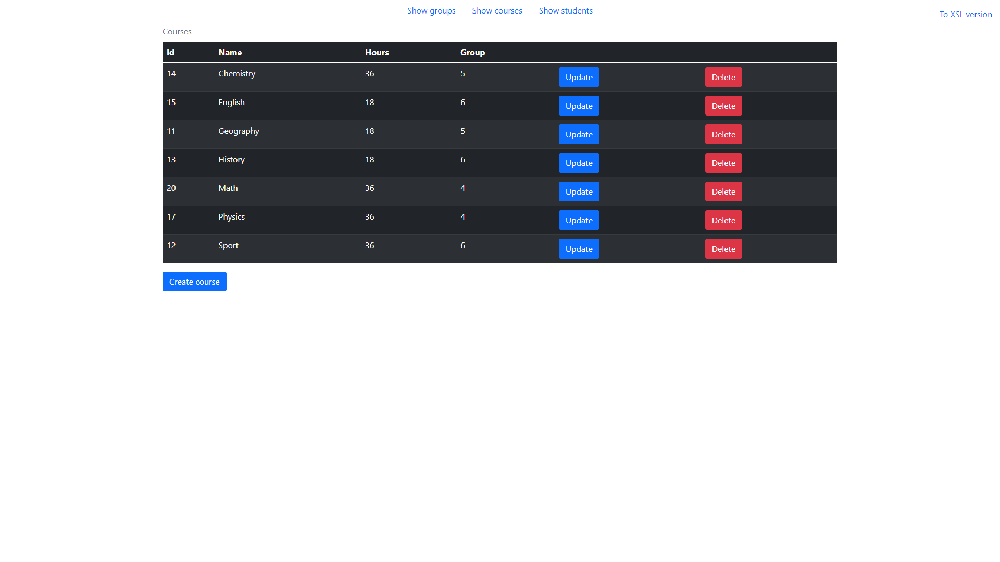
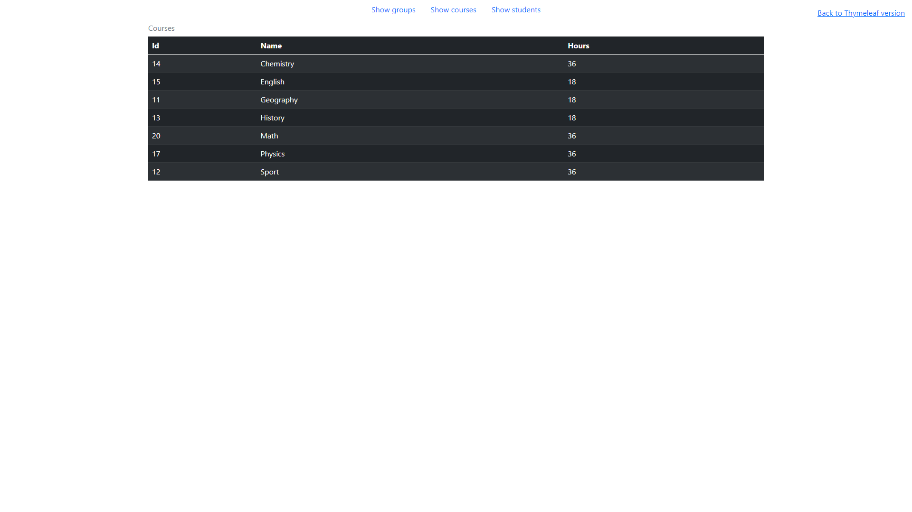

# Practical work #3 for Enterprise Systems Architecture course 
 
- JDK 16.0.2
- Spring Framework 5.3.9
- Tomcat 9.0.52
- PostgreSQL 13.3
- Intellij IDEA Ultimate 2021.2.1

## University

This project is the same as [ESAPracticalWork2](https://github.com/NikitaKharitonov/ESAPracticalWork2) but also
has the REST API for accessing data. The REST API controllers are implemented in the "/controller/rest_api" directory.
There are two types of REST controllers in the program: JSON format controllers in the "/controller/rest_api/json" directory and XML format
controllers in the "/controller/rest_api//xml" directory. The project also has traditional controllers in the 
"/controller/xslt" directory that get data from the REST API in the XML format and convert it to HTML using XSL.

### REST API endpoints
Working with the JSON format: 
- POST   /api/json/courses/create     - create a new course
- GET    /api/json/courses            - get all courses
- GET    /api/json/courses/:id        - get one course by id
- PATCH  /api/json/courses/:id/update - update one course by id
- DELETE /api/json/courses/:id/delete - delete one course by id
- 
- POST   /api/json/groups/create       - create a new group
- GET    /api/json/groups              - get all groups
- GET    /api/json/groups/:id          - get one group by id
- PATCH  /api/json/groups/:id/update   - update one group by id
- DELETE /api/json/groups/:id/delete   - delete one group by id
- GET    /api/json/groups/:id/courses  - get all courses of the group by id
- GET    /api/json/groups/:id/students - get all students of the group by id
- 
- POST   /api/json/students/create     - create a new student
- GET    /api/json/students            - get all students
- GET    /api/json/students/:id        - get one student by id
- PATCH  /api/json/students/:id/update - update one student by id
- DELETE /api/json/students/:id/delete - delete one student by id

The same endpoints are for the XML format but starting with "/api/xml".

### View
The UI is the same as in [ESAPracticalWork2](https://github.com/NikitaKharitonov/ESAPracticalWork2) but also has the 
feature to switch between the two implementations: Thymeleaf and XSLT.
#### Screenshots:

